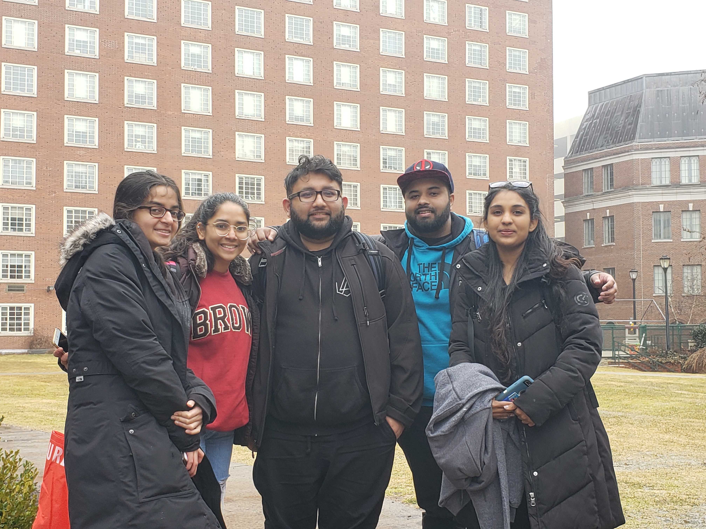

This past weekend I attended my very first Hackathon. As I’m coming towards the end of my bootcamp I wanted to start applying the skills I’ve learned to real world applications. What better way than to head to a hackathon and build something? I learned about the Hack Mental Health at Yale University while browsing through different meetups and hackathons available in my area. The very idea of coming together with other people to create technologies that help people with mental health immediately appealed to me. I’ve personally dealt with these issues and I knew that this was a cause I wanted to contribute to. 

So how did it all work out? All participants were invited to a slack channel prior to the hackathon where we introduced ourselves and slowly started forming teams. Unfortunately, nearly everyone who I had formed a team with was no longer able to come to the hackathon so myself and a friend, Shohan, decided to come together and form a new team. We were able to form a group with three other members: Syntia, Rhythm, and Niyoshi. The diverse backgrounds that all of our team members brought gave myself and Shohan a chance to work with others who are not necessarily developers but who brought in a lot of industry knowledge as well as design knowledge. 

It took us quite some time to settle on an idea (which I’ll share in a future post) and our coding began late afternoon on day 2. While I am very happy with the idea we initially settled on, one of the biggest takeaways from this experience that I had personally is that it would likely be better to come in with at least some pre thought out ideas since there is a time limit on how long we have to develop our products. While in some cases (mine included) it may be hard if your initial team falls apart or you aren’t able to connect with other members as much as you would like prior to the event, even some brainstorming alone would be beneficial. While the rules say you can’t code prior to the event, brainstorming is something that can be done way ahead of the game. 

I enjoyed the fact that there were not as many developers in our group, it gave myself and Shohan the chance to really work and develop something new on our own. We dove into web development full force just a few months ago and were surprised at how much we were able to accomplish at the in just two days. While I was initially intimidated by seeing so many different developers with so much more experience than us, the experience I gained from this weekend was priceless. I appreciated working through an idea and building it up from scratch with input from designers, industry specialists, and even some help from experienced developers who were part of the event as mentors and speakers. I had the chance to sit down and work out parts of my code with a software engineer from Twilio, which was also a great experience getting a glimpse at how experienced developers work. Hint: it still involves lots of google searching! 

Attending this event has made me hungry for more, I loved the atmosphere and the creative energy from everyone around us and the learning experience that came from this was absolutely priceless. If you are interested in attending a hackathon and are able to attend one on the west coast I highly recommend checking out Hack Mental Health’s next Hackathon at UCSF. You can learn more about that by visiting <a href = https://www.hackmentalhealth.care/ target="_blank">Hack Mental health’s webpage</a>. This will take place next month between March 23rd and 24th. Don’t miss out if you’re able to attend! This is a hackathon that really pushes you to create amazing software that can impact people in a positive way, and it’s not just for hackers! Even if you are still starting out and don’t feel confident, attend anyway. I am still a beginner but I know I want to create those experiences that will push me to develop my skills. 

Be on the lookout for our hackathon creation, a Chrome extension named Evie coming to a blog post near you very soon! 