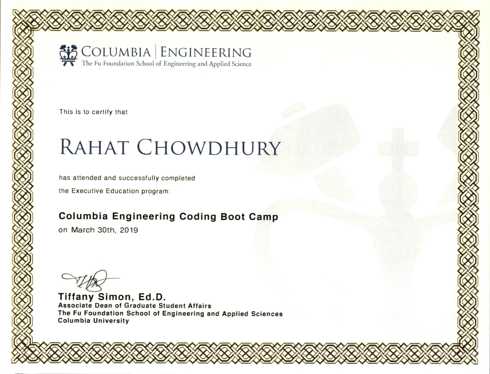

In the summer of 2018 I made the decision that I wanted to fully invest in getting myself real marketable skills in web development. I researched a few different bootcamps and my best friend eventually sent me information for a Bootcamp being held at Columbia University. My first level of attraction to this was, wow ok this has Columbia’s name attached to it which gives me some comfort versus some of the other bootcamps I was looking at it. When I applied and spoke to an advisor I learned that the company Trilogy Education has these Bootcamps at various prestigious colleges all over the country. This helped me ease into things knowing there were a few more University’s all backing this and I decided to go for it. 

The entry process didn’t prove to be very difficult and I was quickly accepted into a cohort at Columbia that was starting in September. Some time before the Boot Camp began there was some pre-work that was sent out, which was designed to give us a introduction to basic HTML, CSS, and JavaScript. 

I often joke with my classmates that the hardest part of this bootcamp was the HTML and CSS portion. The reason being, when we started with that I was a complete novice. I went from not realizing that the styling I was doing in my div is already CSS, to making complex applications with technologies like React and GraphQL. The error and frustrations that I suffered through at the start of the Boot Camp made me better identifying bugs with my code once we got to more complex bits of code. 

There are a lot of mixed reviews about this bootcamp but at the end of the day, you get out what you put into it. The curriculum itself suggest that you dedicate time to reviewing and additional learning. Meaning they don’t expect you to be experts by simply taking this bootcamp. The real value of this bootcamp, is learning how to learn. It’s learning how to find answers, it’s learning how to expand your skills by diving into things headfirst. I don’t think any bootcamp can make you a “rockstar” dev within three or six months.

I put in many hours of sitting in front of Atom and later VS Code after work and on weekends. Sleep was a rare commodity for quite some time once I immersed myself into code. I’m sure many of my coworkers could tell you about my complaints of being tired and walking into the office looking like a zombie. It was a grueling experience but nonetheless one I was willing to fight through. Oh and my wife also complained that I wouldn’t come to bed because I was preoccupied with code, but that’s another story. I may not be a senior engineer yet but I’m working my towards it. 

Regardless of not becoming this incredibly gifted dev, this has been one of the best experiences I’ve had. I have no regrets taking this course and am incredibly grateful for the things I’ve learned. In addition to completing this bootcamp, I was also working and taking on several online Udemy courses and other instructional courses from Front End Masters and Wes Bos. At one point I realized I was just shoving a lot of different types of information into my head and I needed to focus on things in smaller chunks for it to stick. I got a little too excited with all of the additional learning I was doing. 

With my bootcamp now past me I’m preparing myself to take a leap into the unknown and transition careers into web development. While keeping my current full time job I’ve also taken on a part time position as a lead developer at an early stage startup. This startup was a finalist at a hackathon I attended and recruited myself and two other devs to bring their product to life. I’ll hopefully be able to share more on this soon! 

I am now taking a leap into the unknown and hoping to transition careers into web development full time. I’ve been in Customer support for several years now and I am ready for a new challenge doing something I actually love. If you are new to coding, the best advice I can give is don’t give up. I’m not fully where I want to be just yet but I’ve learned to keep it moving. I’ve learned to get back up and keep trying even when the code just won’t behave the way you want it. It might be because you forgot to put a “t” in “style” or never saved your changes. These are issues that pop up for everyone and sometimes you need to take a breath and look at your code from different perspectives to figure out what is wrong. 

I came from being extremely frustrated with creating a simple Hangman game to creating online forums with user authentication and pagination and so much more. Ultimately you need to enjoy this field to be truly good at it. I’m giving myself a win on this one and saying, yeah I’m pretty good what I do. 

Once I have made my jump into a full-time position I’ll follow up with the process and then maybe another follow up after my first month on the job. 

Stay tuned for my upcoming series of posts “How JavaScript Works!”

